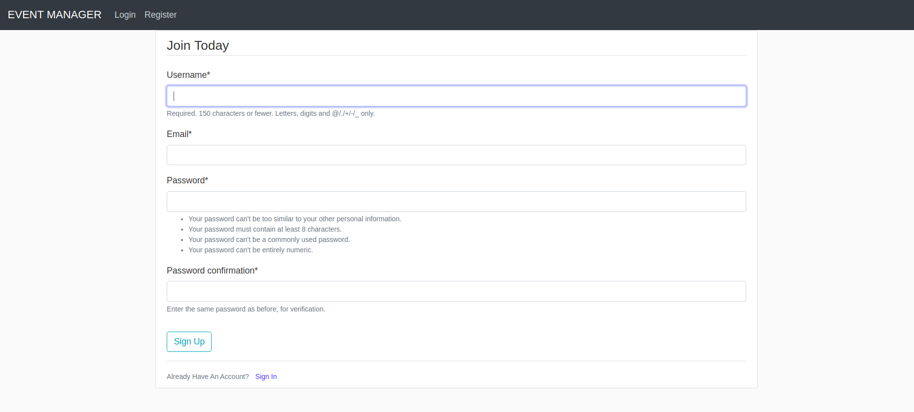
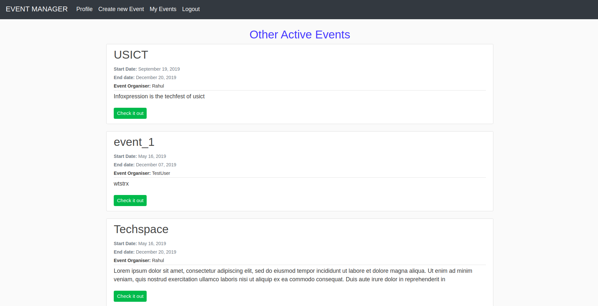
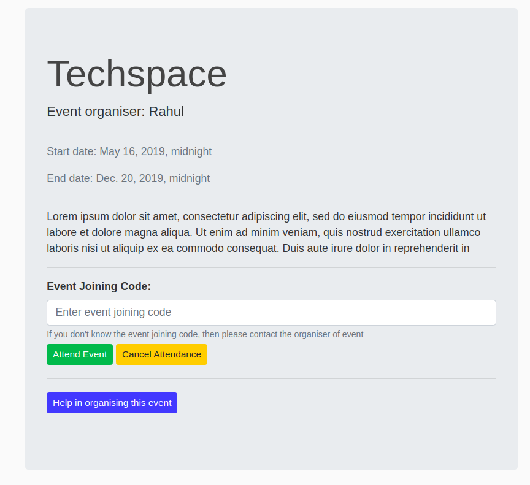
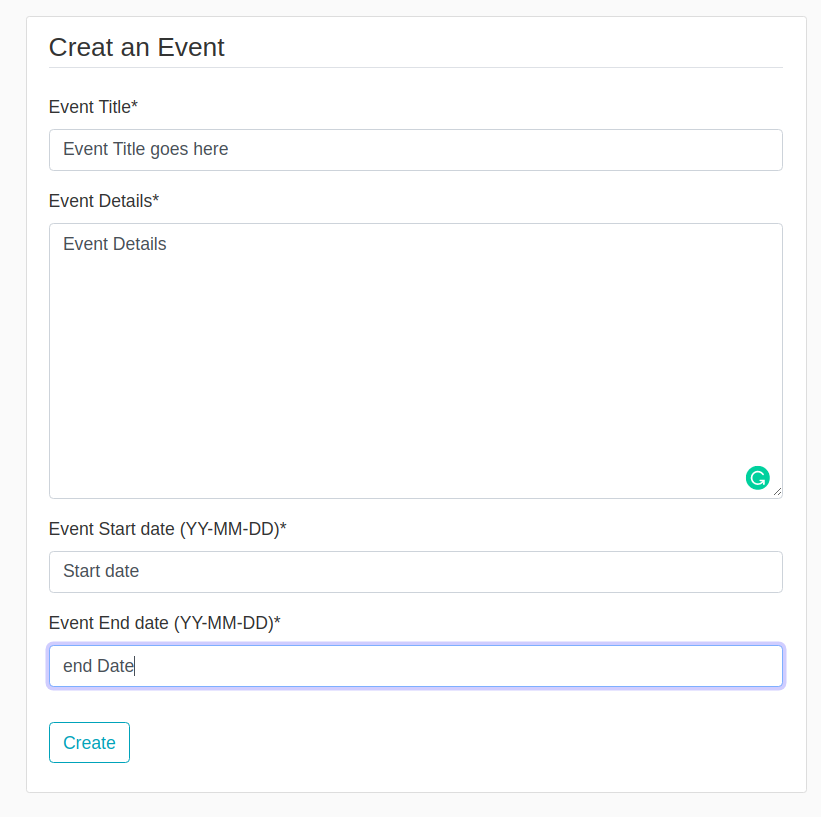
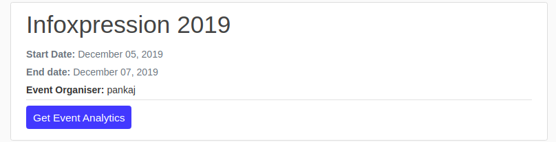
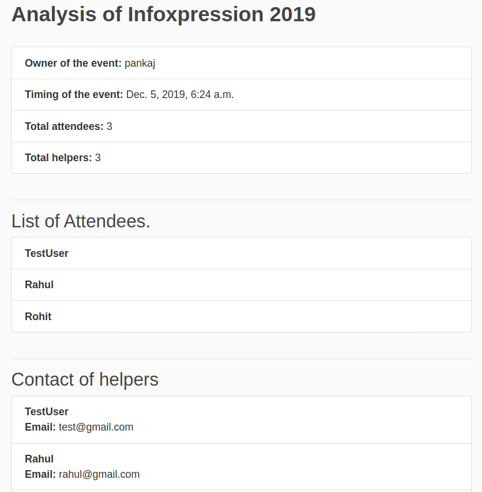

# event_handler
This repo contains the source code for event manager api.

Register as a new user

All the currently active events of other users

Get detail of a particular event

Creating a new event

We can get analytics of our events

